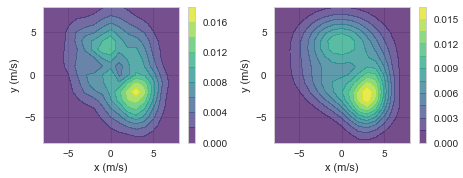
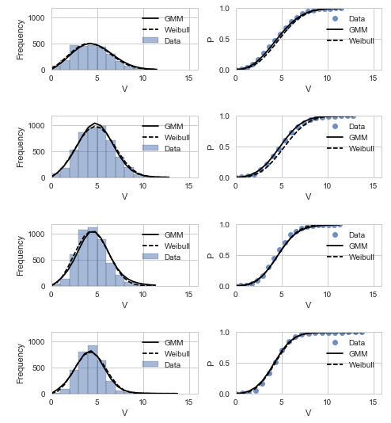
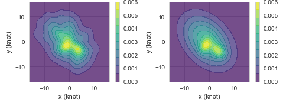
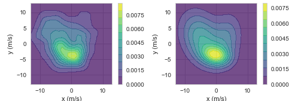
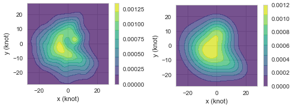
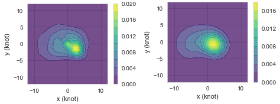
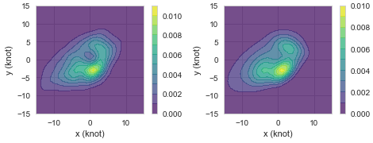
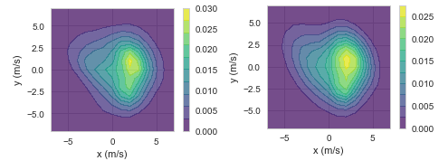
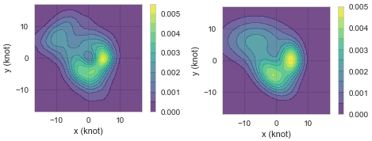
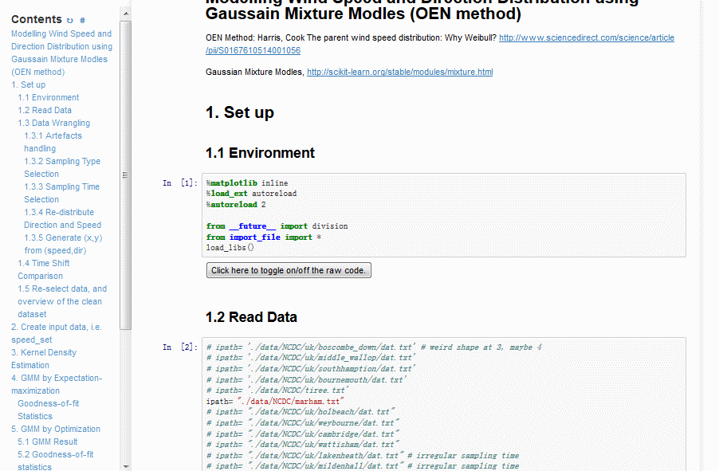

# A Probability Model for the Joint Distribution of Wind Speed and Direction (Gaussian Mixture Models, GMM)

## What is this?

This is a Python program for modeling the joint distribution of wind speed and direction.

The method is based on:

1. Harris, Cook, The parent wind speed distribution: Why Weibull?, http://www.sciencedirect.com/science/article/pii/S0167610514001056

2. Gaussian Mixture Models, http://scikit-learn.org/stable/modules/mixture.html

## Fitting Effect

Take Shanghai Hongqiao Intl as an example

### 1. PDF (Probability Density Function) Comparison

Left: Empirical PDF, Right: Model PDF

### 2. Speed and Direction Distribution Comparison

Histogram vs. Model

### 3. Sectoral Comparison

Left: Histogram vs. Model, Right: Empirical vs. Model CDF

### 4. Live Demo

The above results are available at
https://cdn.rawgit.com/cqcn1991/Wind-Speed-Analysis/master/output_HTML/hongqiao_intl.html
, along with other analysis.

## Applications

This model can be used to obtain the wind speed distribution, wind direction distribution and the joint distribution of wind speed and direction distribution with good accuracy.

Its potential applications include:

1. Wind energy evaluation, wind resource assessment (long term). For example, the optimization of wind farm layout.

2. Wind load analysis on structures, such as fatigue analysis. For example, the wind load on highrise buidings.

3. Pedestrian-level wind environment assessment.

## Gallery

Here is how the method applies to different places across the world. The Weibull distribution is listed as the traditional model for comparison.

### 1. North America

#### [Minneapolis, USA](https://cdn.rawgit.com/cqcn1991/Wind-Speed-Analysis/master/output_HTML/minneapolis.html)

#### [Boston 16 NM East, USA (Offshore)](https://cdn.rawgit.com/cqcn1991/Wind-Speed-Analysis/master/output_HTML/boston_16nm.html)

### 2. Europe

#### [Tiree, UK](https://cdn.rawgit.com/cqcn1991/Wind-Speed-Analysis/master/output_HTML/tiree.html)

#### [Pau Pyrenees, France](https://cdn.rawgit.com/cqcn1991/Wind-Speed-Analysis/master/output_HTML/pau_pyrenees.html)

#### [Landsberg Lech, Germany](https://cdn.rawgit.com/cqcn1991/Wind-Speed-Analysis/master/output_HTML/landsberg_lech.html)

### 3. East Asia

#### [Luogang, China](https://cdn.rawgit.com/cqcn1991/Wind-Speed-Analysis/master/output_HTML/hefei_luogang.html)

### 4. Mid East

#### [Al Maktoum Intl, United Arab Emirates](https://cdn.rawgit.com/cqcn1991/Wind-Speed-Analysis/master/output_HTML/al_maktoum.html)

You can use the code toggle button and sidebar to navigate these reports.

## The Probability Model

The model I'm using is Gaussian Mixture Model, or simply put, the sum of some normal distributions. The idea is very simple:

#### 1. For a certain wind character, the wind vector (speed and direction) follows the normal distribution:

#### 2. For specific location, its wind speed direction distribution is composed of several such wind characters, and hence the sum of several normal distributions:

fi is the PDF of normal distribution component, pi is its weight.

The chief beauty of this model is its elegance (simplicity). You can use such a simple model (GMM) to describe wind, contrary to previous Weibull combination and others. 

For a complete explanation of how GMM fit the joint distribution of wind speed and direction, you can read 

> Harris, Cook, The parent wind speed distribution: Why Weibull?, http://www.sciencedirect.com/science/article/pii/S0167610514001056

And I'm also working on a paper about it, this is my Master Thesis. And if you have any interest (question, collaboration...) feel free to ask me. I open source the project is meant to help you try it.

## How to use it

### 1. Install Anaconda

Download at
https://www.continuum.io/downloads

This repo use Python 3, so you should use the 3 as well.

### 2. Download the code

### 3. Additional Environment Configuration

After installing Anaconda, there are still some additional packages you need to install:

Just run these in your command line to install them

    pip install -r requirements.txt

### 4. GMM Fitting 

- You can start with barebone fitting with `barebone_fitter.ipynb`. It takes data in x, y format and output the GMM params directly. 

- For complete analysis and fitting for GMM, use `GMM.ipynb`. It includes data analysis, fitting and validation with many plots.

- Example wind data can be find at https://github.com/cqcn1991/Wind-Speed-Analysis/tree/master/data ,
For additional data, you can find them at http://www.ncdc.noaa.gov/ or http://ecmwf.int/

If you have any question, you could post it at [issue](https://github.com/cqcn1991/Wind-Speed-Analysis/issues), or mail me at 38306608#qq.com

### 5. R configuration (optional)

The program now uses some R packages to fit von Mises mixture model. You can either delete related code, or install R and Rpy 2 to enable this feature. Specifically: 

- Install R and R studio from [https://cran.r-project.org/](https://cran.r-project.org/) and [https://www.rstudio.com](https://www.rstudio.com) 

- Install R packge movMF from [https://cran.r-project.org/web/packages/movMF/index.html](https://cran.r-project.org/web/packages/movMF/index.html), by running `install.packages("movMF")` in R studio

- Install Rpy2 for running R with Python

    - For Windows, see [https://stackoverflow.com/questions/14882477/rpy2-install-on-windows-7](https://stackoverflow.com/questions/14882477/rpy2-install-on-windows-7)

## Acknowledgement

This work would be impossible without the help from Cook and Harris. Thank you!